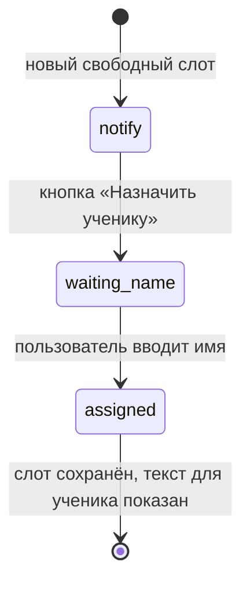

# MusBooking Bot

Telegram-бот для автоматического мониторинга свободных слотов бронирования в музыкальной студии на платформе MusBooking. Бот периодически опрашивает API студии, находит свободные подходящие окна и присылает уведомления; позволяет назначить слот на ученика и посмотреть расписание прямо в Telegram.

Бот работает в режиме **long polling** — сам опрашивает Telegram на наличие новых сообщений, без вебхуков (когда Telegram сам присылает сообщения на сервер). Это простая и надёжная схема для одного бота.

Доступ закрытый: команды работают только для указанного списка Telegram ID (`ALLOWED_IDS` в `.env`). Бот не публичный, сделан под нужды конкретной студии.

> Это парковая/портфолио-сборка. Реальные идентификаторы студии (`ROOM_ID`, `OPTION_ID`), токен и ID пользователей в репозиторий не входят — остаются в `.env` у владельца.

## Что умеет

- **Мониторинг слотов:** каждые 5 минут бот опрашивает API MusBooking и ищет свободные слоты. Учитываются только будни (пн–пт) и время 15:00–20:00; слоты, на которые уже есть бронирование, исключаются.
- **Уведомления о новых окнах:** при появлении ранее не виденного свободного слота бот присылает сообщение с кнопками «Забронировать» (прямая ссылка на виджет бронирования) и «Назначить ученику».
- **Назначение ученика:** по кнопке бот спрашивает имя ученика, сохраняет привязку «слот → ученик» и подсказывает текст, который можно скопировать и переслать ученику.
- **Расписание:** команда `schedule` открывает панель с датами — выбираешь дату и видишь список уроков на день с временем и именами.
- **Ручная проверка слота:** можно написать `1503-1500` (формат `ДДММ-ЧЧММ`) — бот проверит, свободен ли конкретный слот прямо сейчас.
- **Утреннее расписание:** каждый день после 7:00 по Москве бот присылает список уроков на сегодня (если они есть).
- **Защита от дублей:** слоты, о которых уже уведомляли, не присылаются повторно (хранятся в `seen_slots.json`).

## Стек

- **Python** 3.12+
- **aiogram** 3.x — библиотека для Telegram-ботов (FSM, Router, long polling)
- **aiohttp** — асинхронные HTTP-запросы к API MusBooking
- **python-dotenv** — конфигурация через `.env`

Хранение состояния — в JSON-файлах (`seen_slots.json`, `assignments.json`), базы данных нет: объём данных небольшой, отдельная БД избыточна.

## Сценарий назначения ученика (FSM)



 Назначение идёт через FSM («автомат состояний»): бот запоминает текущий шаг — ждёт имя ученика, — и только после ввода сохраняет привязку и выходит из сценария.

## Запуск

**Локально:**
```bash
python3.12 -m venv .venv
source .venv/bin/activate          # Windows: .venv\Scripts\activate
pip install -r requirements.txt
cp .env.example .env               # заполнить BOT_TOKEN, ALLOWED_IDS, ROOM_ID, OPTION_ID
python main.py
```

**Продакшн (VPS, systemd):** см. [DEPLOY.md](DEPLOY.md) — инструкция по первичной установке и обновлению через systemd-сервис.

## Команды и текстовые триггеры

| Команда / текст | Действие |
|---|---|
| `schedule` или `/schedule` | Открыть панель расписания по датам |
| `1503-1500` (формат `ДДММ-ЧЧММ`) | Проверить конкретный слот вручную |
| `check 1503-1500`, `чек …`, `проверить …` | То же самое с префиксом |

Кнопки в уведомлении о слоте: «🎟 Забронировать» (открывает виджет MusBooking) и «👤 Назначить ученику» (запускает сценарий назначения).

## Переменные окружения (`.env`)

| Переменная | Описание |
|---|---|
| `BOT_TOKEN` | Токен бота от [@BotFather](https://t.me/BotFather) (обязательно) |
| `ALLOWED_IDS` | Telegram ID пользователей с доступом, через запятую (обязательно) |
| `ADMIN_ID` | ID администратора — получает отчёты об ошибках отправки |
| `ROOM_ID` | ID комнаты студии на MusBooking (обязательно, приватное) |
| `OPTION_ID` | ID опции бронирования на MusBooking (обязательно, приватное) |

`ROOM_ID` и `OPTION_ID` — приватные идентификаторы конкретной студии, в код не зашиты и в репозиторий не входят. Шаблон значений — в `.env.example`.

## Внутренние настройки

Параметры задаются константами в `main.py`:

- `CHECK_INTERVAL_SEC` — интервал проверки слотов, 300 с (5 минут).
- `DAYS` — глубина выборки слотов вперёд, 14 дней.
- `MOSCOW_TZ` — часовой пояс для утренней напоминалки, Europe/Moscow.
- Логика фильтрации слотов — функция `is_slot_matching()` (по умолчанию будни 15:00–20:00).

## Структура проекта

```
.
├── main.py             # основная логика: мониторинг, парсинг API, FSM, расписание, напоминания
├── requirements.txt    # зависимости Python
├── .env.example        # шаблон переменных окружения
├── .gitignore          # что не загружать в git
├── DEPLOY.md           # инструкция деплоя на VPS через systemd
├── seen_slots.json     # кэш уже уведомлённых слотов (генерируется автоматически)
└── assignments.json    # назначения учеников по слотам (генерируется автоматически)
```

`seen_slots.json` и `assignments.json` создаются при работе и в репозиторий не входят (в `.gitignore`).

## Что есть и чего нет (честно)

- Состояние FSM хранится в оперативной памяти (`MemoryStorage`) — при рестарте незавершённое назначение слота сбрасывается. Завершённые назначения сохраняются в `assignments.json`.
- Хранение — JSON-файлы, не база данных: для объёма одной студии этого достаточно, под рост нагрузки стоило бы перейти на SQLite/PostgreSQL.
- Доступ к API MusBooking идёт без токена (публичные endpoint'ы конкретной студии по `ROOM_ID/OPTION_ID`). Если дальше появится закрытый API с ключом — его тоже вынести в `.env`.
- Логирование — в консоль (`print`), без файловых логов и системы мониторинга ошибок.
- Автотестов нет.

## Лицензия

MIT — код распространяется свободно. Идентификаторы студии, токены и пользовательские данные в репозиторий не входят и остаются у владельца.
